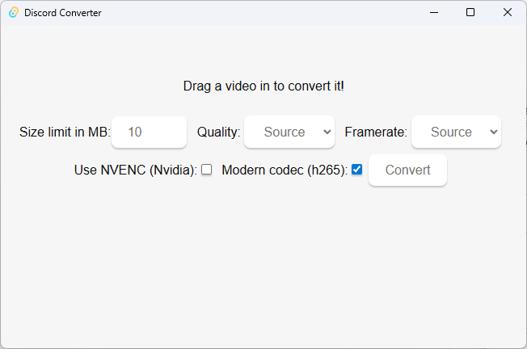

# Discord Converter



Basically a ffmpeg GUI that lets you set a maximum filesize and converts a video with that in mind. Great for Discord's very generous filesize limits.

Only tested with Windows 11.

# Todos

- handle multiple audio/subtitle streams
  - throw subtitles and extra streams away initially, then implement subtitle hardsubbing with the subtitles video filter
- HDR to SDR tonemapping
- Config file that gets created when it doesnt exist yet
    - Configure defaults in settings
- Write tests and proper logging/error handling
- Create a custom icon for the program
- Design a proper UI
- Abort button

# How to build

Add the ffmpeg and ffprobe exes to `src-tauri/bin` and rename them to:

`ffmpeg-x86_64-pc-windows-msvc.exe`
`ffprobe-x86_64-pc-windows-msvc.exe`

## Start dev server

```sh
npm run tauri dev
```

## Test the thing (backend only for now)

```sh
npm test
```

## Build the thing

```sh
npm run tauri build
```